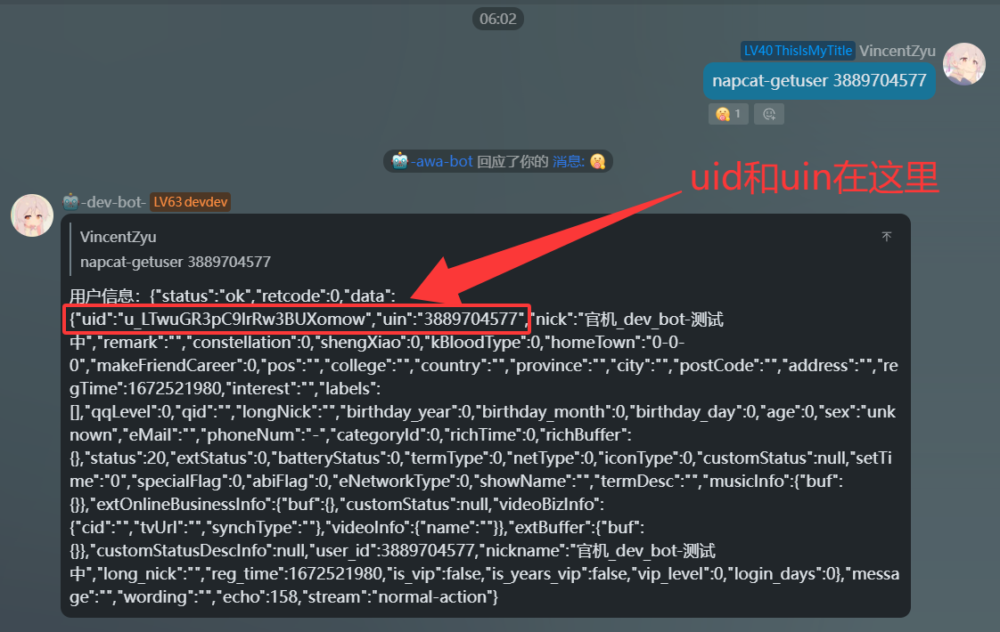
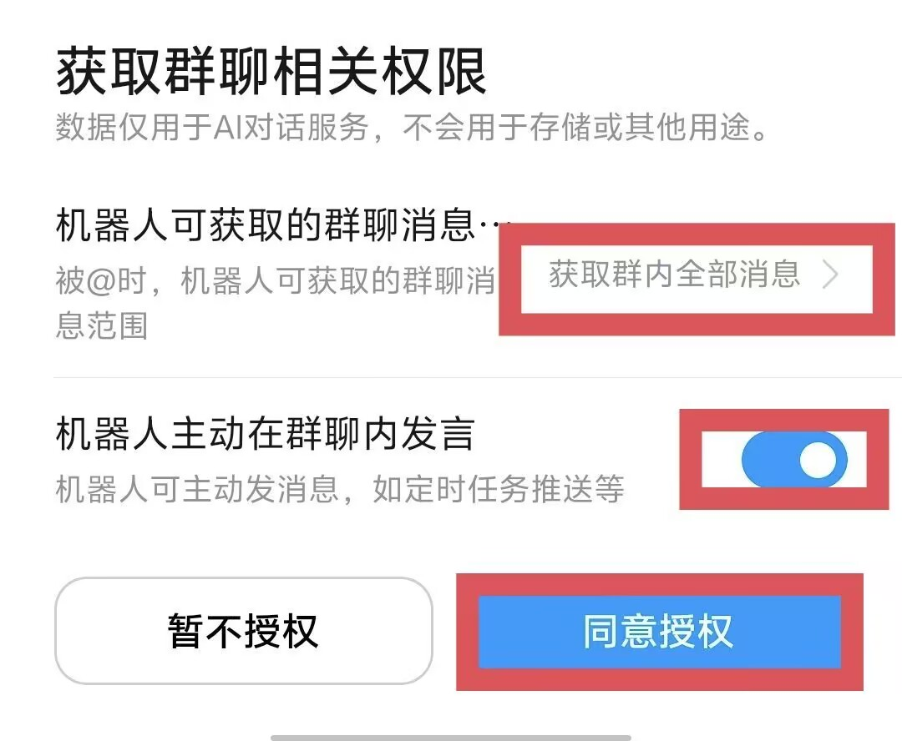
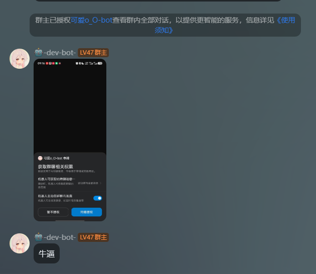
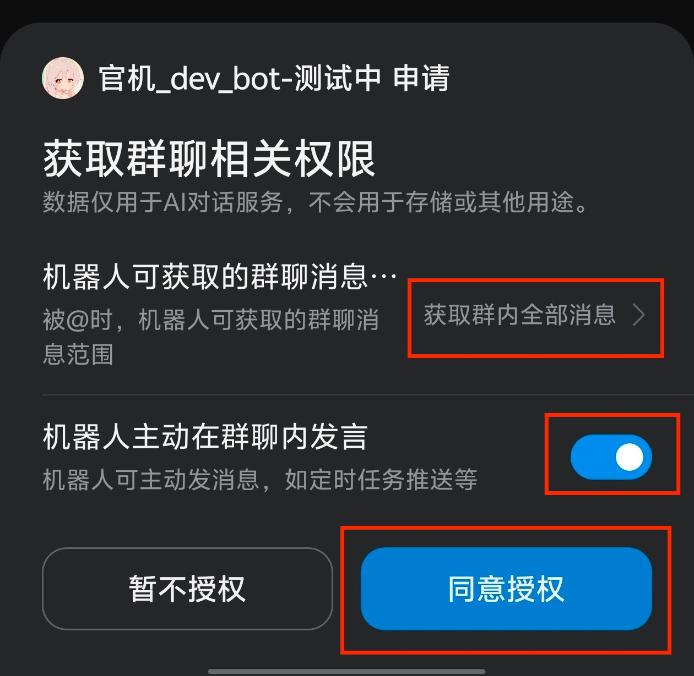
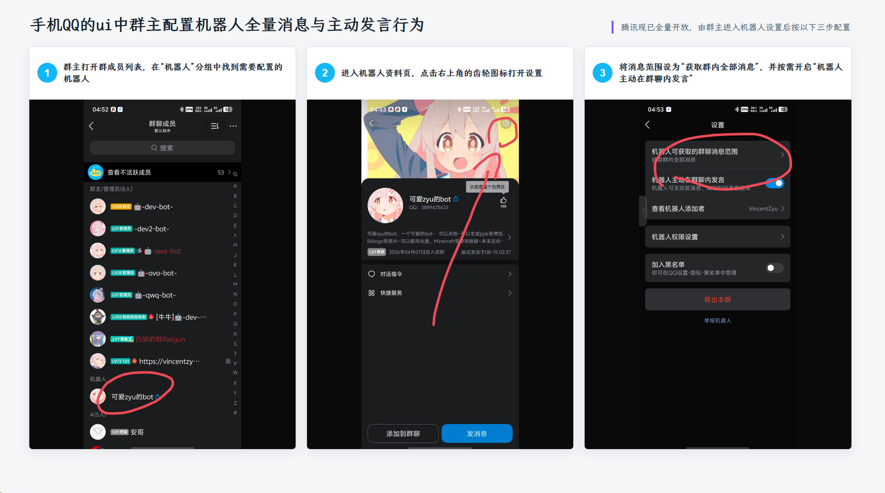
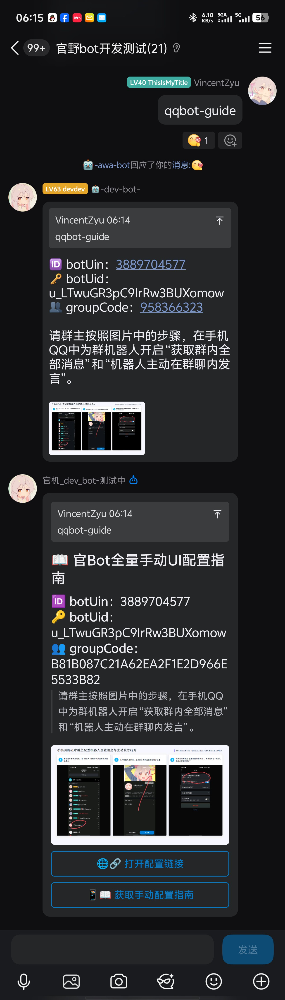

# koishi-plugin-get-qq-bot-transfer-link

利用 [NapCat](https://github.com/NapNeko/NapCatQQ) 获取官bot的uid，然后获取本群的 开放官bot的全量和主动的配置链接，然后群主用手机qq打开就可以配置了

<del>💬 插件使用问题 / 🐛 Bug反馈 / 👨‍💻 插件开发交流，欢迎加入QQ群：<b>259248174</b>   🎉（这个群G了</del> 
 

💬 插件使用问题 / 🐛 Bug反馈 / 👨‍💻 插件开发交流，欢迎加入QQ群：<b>1085190201</b> 🎉

💡 在群里直接艾特我，回复的更快哦~ ✨

---

## 📝 Markdown 发送说明

本插件支持在 QQ 官方平台以 **Markdown + 按钮** 格式发送消息，自动检测 adapter 类型选择发送路径。

### 两种场景

| 场景 | 发送内容 |
|---|---|
| **传了群号** | Markdown 富文本（botUin/botUid/groupCode 信息 + 操作提示图片）+ 「打开配置链接」跳转按钮 |
| **缺群号** | 根据 `missingGroupCodeSendMode` 配置，支持三种模式：`text`（纯文本）/ `markdown`（纯 Markdown）/ `markdown_button`（Markdown + 自定义按钮） |

### Adapter 兼容

- **Crack adapter**（`koishi-plugin-adapter-qq-crack`）— 走 `h('qq:rawmarkdown')` 元素层，完整支持自定义 Markdown 内容
- **官方 adapter**（`@koishijs/plugin-adapter-qq`）— 走 internal API + 手动被动回复上下文（msg_id/msg_seq），也支持 Markdown + 按钮

---

## ⚙️ 配置项

| 配置项 | 类型 | 默认值 | 说明 |
|---|---|---|---|
| `useMarkdown` | boolean | `true` | QQ平台使用 Markdown 富文本发送 |
| `addJumpButton` | boolean | `true` | 两个 `qqbot-*` 指令底部添加共享键盘 |
| `qqBotCommandKeyboardJson` | string | 见配置页 | 两个 `qqbot-*` 指令共用的键盘 JSON 模板 |
| `defaultBotUin` | string | `""` | 默认官Bot QQ号（option 兜底） |
| `defaultBotUid` | string | `""` | 默认官Bot UID（option 兜底） |
| `defaultGroupCode` | string | `""` | 默认群号（option 兜底，再兜底到当前群） |
| `requireGroupCode` | boolean | `true` | 强制要求通过 arg 或 `--groupcode` 传入群号 |
| `showBotInfo` | boolean | `true` | 两个 `qqbot-*` 指令中显示 botUin / botUid / groupCode |
| `qqMarkdownBotInfoStyle` | `text`/`bold`/`inline`/`table` | `bold` | Bot 信息在 Markdown 中的展示样式 |
| `qqTransferLinkGuideText` | string | 见配置页 | 迁移链接说明文字 |
| `qqTransferLinkGuideShowImage` | boolean | `true` | 迁移链接消息附带操作提示图片 |
| `qqTransferLinkGuideImageUrl` | string | jsDelivr 直链 | 迁移链接操作提示图片 URL |
| `qqTransferLinkGuideImageWidth` | string | `1080px` | 迁移链接 Markdown 图片宽度 |
| `qqTransferLinkGuideImageHeight` | string | `888px` | 迁移链接 Markdown 图片高度 |
| `qqUiSettingsGuideText` | string | 见配置页 | 手机QQ手动配置指南说明文字 |
| `qqUiSettingsGuideShowImage` | boolean | `true` | 手动配置指南附带图片 |
| `qqUiSettingsGuideImageUrl` | string | jsDelivr 直链 | 手机QQ手动配置指南图片 URL |
| `qqUiSettingsGuideImageWidth` | string | `1871px` | 手动配置指南 Markdown 图片宽度 |
| `qqUiSettingsGuideImageHeight` | string | `1044px` | 手动配置指南 Markdown 图片高度 |
| `missingGroupCodeSendMode` | `text`/`markdown`/`markdown_button` | `markdown` | 缺群号时 QQ 平台的发送模式 |
| `missingGroupCodeMessage` | string | 见配置页 | 缺群号时的纯文本提示 |
| `missingGroupCodeMarkdownContent` | string | 见配置页 | 缺群号时的 Markdown 内容 |
| `missingGroupCodeKeyboardJson` | string | 见配置页 | 缺群号时的自定义按钮 JSON |
| `verboseConsoleLog` | boolean | `false` | 控制台输出每次发送的 payload（调试用） |

## ⌨️ 指令

### `napcat-getuser [userId]`
通过 [napcat onebot](https://github.com/NapNeko/NapCatQQ) 接口查询用户信息。仅在 `onebot` 平台可用。

### `qqbot-url`
生成官Bot全量主动配置链接。

**别名：** `免艾特申请`、`一键跳转免艾特配置`、`一键跳转全量主动配置`

**选项：**
| 选项 | 缩写 | 说明 |
|---|---|---|
| `--botuin` | `-u` | 官Bot的QQ号 |
| `--botuid` | `-i` | 官Bot的UID |
| `--groupcode` | `-g` | 群号 |

**参数优先级：** `指令 arg` > `--option 传参` > `配置项兜底值` > `当前会话群号` > `报错提示`

### `qqbot-guide`
发送手机QQ机器人全量消息与主动发言手动配置指南。

**别名：** `免艾特手动配置指南`、`全量主动手动配置指南`

QQ 平台开启 `useMarkdown` 或 `addJumpButton` 时发送 Markdown，顺序为 Bot 信息、引用说明、可选图片、共享键盘。Guide 不接收身份参数，Bot 信息读取默认配置，群号可继续回退到当前会话，缺失字段显示 `-`。

## 🎹 两个 qqbot 指令共用的键盘模板

`qqBotCommandKeyboardJson` 的默认值由 TypeScript 原生对象生成，支持 `${url}`、`${jumpActionType}`、`${jumpActionData}`、`${jumpEnter}` 占位符。

- `qqbot-url`：第一行按钮直接打开本次生成的迁移链接。
- `qqbot-guide`：第一行按钮填入 `/一键跳转免艾特配置 【在这里填入群号】`，等待用户修改群号；第二行执行 `/qqbot-guide`。
- 模板留空或 JSON 无效时不发送键盘；`qqbot-url` 会回退为在 Markdown 正文中显示链接。

## 🎹 按钮 JSON 填写示范

- [`missingGroupCodeKeyboardJson`：缺群号按钮配置](https://gitee.com/vincent-zyu/koishi-plugin-get-qq-bot-transfer-link/blob/main/doc/json/missing-group-code-keyboard.md)
- [`qqBotCommandKeyboardJson`：两个 qqbot 指令共用按钮配置](https://gitee.com/vincent-zyu/koishi-plugin-get-qq-bot-transfer-link/blob/main/doc/json/qqbot-command-keyboard.md)

## ✨ 效果

### 1️⃣ napcat-getuser
> ↓ 下方图片: 使用 `napcat-getuser <官Bot QQ号>` 查询官Bot信息，并从返回 JSON 中取得 `uid` 与 `uin`。

### 2️⃣ qqbot-url
> ↓ 下方图片: 手机QQ打开迁移链接后，在授权页面开启“获取群内全部消息”和“机器人主动在群聊内发言”，然后点击“同意授权”。

  

> ↓ 下方图片: `qqbot-url` 的帮助、缺少群号提示、传入群号后的链接消息，以及 Markdown 按钮发送效果。

> ↓ 下方图片: 手机QQ弹出的机器人群聊权限授权窗口，确认开启两个权限后点击“同意授权”。

> ↓ 下方图片: 手机QQ权限页中“获取群内全部消息”和“机器人主动在群聊内发言”的具体设置位置。

> ↓ 下方图片: 权限开启后，机器人可以接收未被艾特的群消息的实际效果。

### 3️⃣ qqbot-guide
> ↓ 下方图片: 群主在手机QQ群成员列表中找到机器人、进入资料页设置，并开启全量消息与主动发言的三步操作图。

  

> ↓ 下方图片: `qqbot-guide` 在 QQ 中发送的手动配置指南，包含 Bot 信息、内嵌步骤图和底部快捷按钮。

