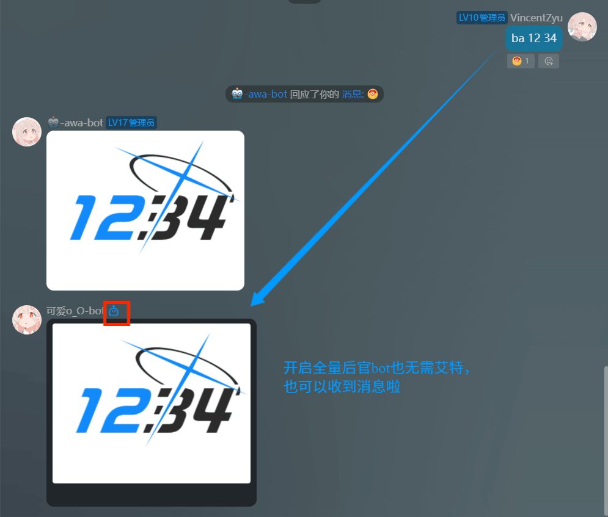

# koishi-plugin-get-qq-bot-transfer-link

利用NapCat获取官bot的uid，然后获取本群的 开放官bot的全量和主动的配置链接，然后群主用手机qq打开就可以配置了

[](https://www.npmjs.com/package/koishi-plugin-get-qq-bot-transfer-link)
[](https://www.npmjs.com/package/koishi-plugin-get-qq-bot-transfer-link)

[](https://github.com/VincentZyu233/koishi-plugin-get-qq-bot-transfer-link)
[](https://gitee.com/vincent-zyu/koishi-plugin-get-qq-bot-transfer-link)

[](https://forum.koishi.xyz/t/topic/12558)
[](https://qm.qq.com/q/4vjto4V7Di)

<p><del>💬 插件使用问题 / 🐛 Bug反馈 / 👨‍💻 插件开发交流，欢迎加入QQ群：<b>259248174</b>   🎉（这个群G了</del> </p> 
<p>💬 插件使用问题 / 🐛 Bug反馈 / 👨‍💻 插件开发交流，欢迎加入QQ群：<b>1085190201</b> 🎉</p>
<p>💡 在群里直接艾特我，回复的更快哦~ ✨</p>

---

## 📝 Markdown 发送说明

本插件支持在 QQ 官方平台以 **Markdown + 按钮** 格式发送消息，自动检测 adapter 类型选择发送路径。

### 两种场景

| 场景 | 发送内容 |
|---|---|
| **传了群号** | Markdown 富文本（botUin/botUid/groupCode 信息 + 操作提示图片）+ 「打开配置链接」跳转按钮 |
| **缺群号** | 根据 `missingGroupCodeSendMode` 配置，支持三种模式：`text`（纯文本）/ `markdown`（纯 Markdown）/ `markdown_button`（Markdown + 自定义按钮） |

### Adapter 兼容

- **Crack adapter**（`koishi-plugin-adapter-qq-crack`）— 走 `h('qq:rawmarkdown')` 元素层，完整支持自定义 Markdown 内容
- **官方 adapter**（`@koishijs/plugin-adapter-qq`）— 走 internal API + 手动被动回复上下文（msg_id/msg_seq），也支持 Markdown + 按钮

---

## ⚙️ 配置项

| 配置项 | 类型 | 默认值 | 说明 |
|---|---|---|---|
| `useMarkdown` | boolean | `true` | QQ平台使用 Markdown 富文本发送 |
| `addJumpButton` | boolean | `true` | 消息底部添加「打开配置链接」跳转按钮 |
| `defaultBotUin` | string | `""` | 默认官Bot QQ号（option 兜底） |
| `defaultBotUid` | string | `""` | 默认官Bot UID（option 兜底） |
| `defaultGroupCode` | string | `""` | 默认群号（option 兜底，再兜底到当前群） |
| `requireGroupCode` | boolean | `true` | 强制要求通过 arg 或 `--groupcode` 传入群号 |
| `showBotInfo` | boolean | `false` | 消息中显示 botUin / botUid / groupCode |
| `qqMarkdownBotInfoStyle` | `text`/`bold`/`inline`/`table` | `bold` | Bot 信息在 Markdown 中的展示样式 |
| `showImage` | boolean | `true` | 链接/按钮上方附带操作提示图片 |
| `imageUrl` | string | gitee raw 直链 | 操作提示图片 URL |
| `imageWidth` | string | `1080px` | Markdown 图片宽度 |
| `imageHeight` | string | `888px` | Markdown 图片高度 |
| `missingGroupCodeSendMode` | `text`/`markdown`/`markdown_button` | `markdown` | 缺群号时 QQ 平台的发送模式 |
| `missingGroupCodeMessage` | string | 见配置页 | 缺群号时的纯文本提示 |
| `missingGroupCodeMarkdownContent` | string | 见配置页 | 缺群号时的 Markdown 内容 |
| `missingGroupCodeKeyboardJson` | string | 见配置页 | 缺群号时的自定义按钮 JSON |
| `versionHint` | string | `安卓和iOS QQ 9.2.90及以上版本可用` | 版本兼容提示文案 |
| `verboseConsoleLog` | boolean | `false` | 控制台输出每次发送的 payload（调试用） |

## ⌨️ 指令

### `napcat-getuser [userId]`
通过 napcat onebot 接口查询用户信息。仅在 `onebot` 平台可用。

### `qqbot-url`
生成官Bot全量主动配置链接。

**选项：**
| 选项 | 缩写 | 说明 |
|---|---|---|
| `--botuin` | `-u` | 官Bot的QQ号 |
| `--botuid` | `-i` | 官Bot的UID |
| `--groupcode` | `-g` | 群号 |

**参数优先级：** `指令 arg` > `--option 传参` > `配置项兜底值` > `当前会话群号` > `报错提示`

## 🎹 缺群号按钮 JSON 示例

### 示例1 - 快速填充指令
```json
{"rows":[{"buttons":[{"id":"cmd_1","render_data":{"label":"🔢重新输入群号(点我快速填入指令)","style":1},"action":{"type":2,"permission":{"type":2},"data":"qqbot-url -g ","enter":false,"reply":false,"unsupport_tips":"请更新QQ版本后使用"}}]}]}
```

### 示例2 - 跳转网页链接
```json
{"rows":[{"buttons":[{"id":"help_1","render_data":{"label":"❓查看帮助(url编码规则)","style":1},"action":{"type":0,"permission":{"type":2},"data":"https://forum.koishi.xyz/t/topic/12558","unsupport_tips":"请更新QQ版本后使用"}}]}]}
```

### 示例3 - 两按钮一起
```json
{"rows":[{"buttons":[{"id":"cmd_2","render_data":{"label":"🔢重新输入群号","style":1},"action":{"type":2,"permission":{"type":2},"data":"qqbot-url -g ","enter":false,"reply":false,"unsupport_tips":"请更新QQ版本后使用"}},{"id":"help_2","render_data":{"label":"❓查看帮助","style":0},"action":{"type":0,"permission":{"type":2},"data":"https://forum.koishi.xyz/t/topic/12558","unsupport_tips":"请更新QQ版本后使用"}}]}]}
```

### 示例4 - 自定义操作按钮（不带 id）
```json
{"rows":[{"buttons":[{"render_data":{"label":"📝再试一次","style":1},"action":{"type":2,"permission":{"type":2},"data":"/免艾特申请","enter":true}},{"render_data":{"label":"🎈玩玩其他的","style":1},"action":{"type":2,"permission":{"type":2},"data":"/help","enter":true}}]}]}
```

## ✨ 效果



