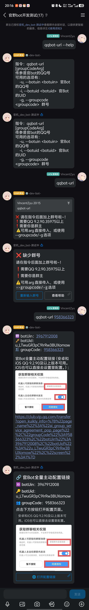

# koishi-plugin-get-qq-bot-transfer-link

利用NapCat获取官bot的uid，然后获取本群的 开放官bot的全量和主动的配置链接，然后群主用手机qq打开就可以配置了

## ⚙️ 配置项

| 配置项 | 类型 | 默认值 | 说明 |
|---|---|---|---|
| `useMarkdown` | boolean | `true` | QQ平台使用 Markdown 富文本发送 |
| `addJumpButton` | boolean | `true` | 消息底部添加「打开配置链接」跳转按钮 |
| `showBotInfo` | boolean | `false` | 消息中显示 botUin / botUid / groupCode |
| `showImage` | boolean | `true` | 链接/按钮上方附带操作提示图片 |
| `imageUrl` | string | gitee raw 直链 | 操作提示图片 URL |
| `imageWidth` | string | `1080px` | Markdown 图片宽度 |
| `imageHeight` | string | `888px` | Markdown 图片高度 |
| `defaultBotUin` | string | `""` | 默认官Bot QQ号（option 兜底） |
| `defaultBotUid` | string | `""` | 默认官Bot UID（option 兜底） |
| `defaultGroupCode` | string | `""` | 默认群号（option 兜底，再兜底到当前群） |

## ⌨️ 指令

### `napcat-getuser [userId]`
通过 napcat onebot 接口查询用户信息。仅在 `onebot` 平台可用。

### `qqbot-url`
生成官Bot全量主动配置链接。

**选项：**
| 选项 | 缩写 | 说明 |
|---|---|---|
| `--botuin` | `-u` | 官Bot的QQ号 |
| `--botuid` | `-i` | 官Bot的UID |
| `--groupcode` | `-g` | 群号 |

**优先级：** `--option 传参` > 配置项兜底值 > 报错提示

## ✨ 效果

